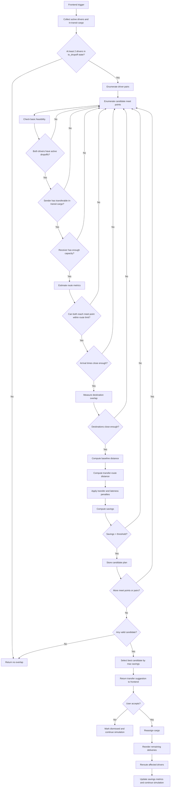

# Overlap Detection Flowchart

## Purpose

This flowchart describes the overlap-detection and transfer-selection algorithm at a high level.

The frontend is intentionally kept simple:

- trigger the planner when simulation state changes
- receive either `no overlap` or `transfer suggestion`
- show the suggestion to the user
- apply the accepted plan

## Flowchart



## Frontend Trigger

The frontend does not need to solve the overlap itself.
It only needs to call the planner when one of these events happens:

- a new package enters the simulation
- a driver picks up a package
- a driver starts a dropoff leg
- a package is delivered
- a previous transfer is accepted or dismissed
- a periodic replan interval is reached

## Decision Logic

The overlap planner can be described in this order:

1. Filter to drivers currently delivering cargo.
2. Build all driver pairs.
3. For each pair, test all candidate meet points.
4. For each meet point, test whether a sender-to-receiver handoff is feasible.
5. Reject the candidate if timing, capacity, transferability, or destination proximity fails.
6. Estimate baseline route cost.
7. Estimate transfer route cost.
8. Subtract penalties.
9. Keep only candidates with positive savings above a minimum threshold.
10. Return the best plan.

## Simplified Savings Formula

```text
savings =
  direct_distance
  - transfer_distance
  - transfer_penalty
  - lateness_penalty
```

Where:

- `direct_distance` = both drivers finish separately
- `transfer_distance` = both drivers travel to meet point + receiver completes remaining deliveries
- `transfer_penalty` = fixed friction cost to avoid unrealistic handoffs
- `lateness_penalty` = penalty if the transfer plan risks missing delivery timing

## Planner Output

The planner should return either:

### No overlap

```text
{
  status: "none"
}
```

### Transfer suggestion

```text
{
  status: "suggested",
  receiverDriverId,
  senderDriverId,
  transferPackageIds,
  meetPointId,
  meetPointLabel,
  directDistanceKm,
  optimizedDistanceKm,
  potentialSavingKm,
  potentialCO2Saving,
  arrivalWindowSec
}
```

## Hackathon Scope

To keep this stable and explainable during a demo:

- use a small number of drivers
- use a small number of packages
- use fixed meet points
- allow at most one transfer per package
- choose the best single suggestion at a time

That keeps the logic understandable and the visualization clean.
